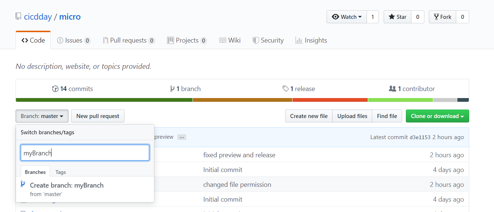
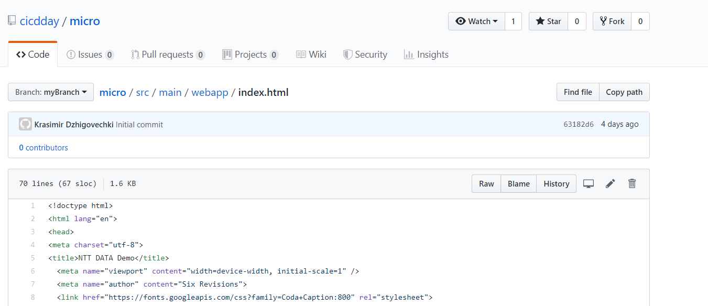
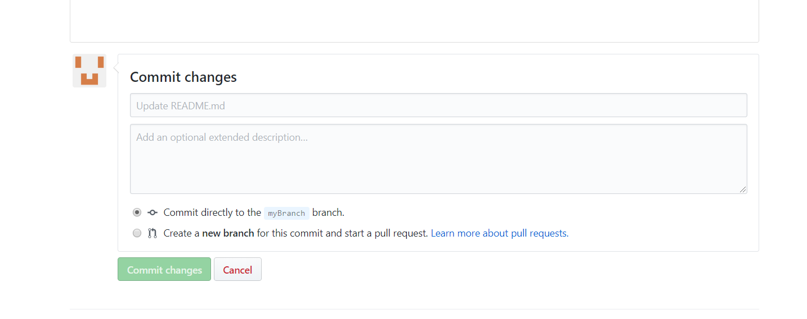
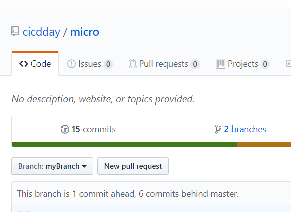

# Get access to github
First, you need to get access to the GitHub account cicdday

see [GitHub Access](../../github-access/README.md)

# Tasks

## Task - Start the Developer Flow
In order to start the developer flow you have to create your own feature branch, make a change to the code and create a pull request to the master.

The GitHub UI way is described below but in case you have git installed and maybe even an IDE on your local machine feel free to use it.

### Create a branch  
**Hint:** Give your branch a proper name so you find it easily.



### Update the application 
Open the index.html file in the folder *micro/src/main/webapp* and edit the "Hi from Enso" to "Hi from **$YOUR_NICKNAME**". In order to edit the file in the browser please click the pencil on the right hand side. 



### Commit your changes
Scroll down the page to commit your changes



### Create a pull request
Go back to the repository root directory in order to create the Pull Request. 

**Hint:** Give your pull request a proper name so you can find it easily.



### Check the pipeline
Follow this link to find the pipelines for all pull requests [pr-pipelines](http://jenkins.jx.cloud-poc-station.com/job/cicdday/job/micro/view/change-requests/).

**Hint:** You need to know our pull request number in order to find your pull request job from the list.


# Open the Preview Environment
Search for *Preview application is now available at:* in the console log of your builds and follow the link. 

## Task - Add a Step to the build pipeline (Advanced)
Open the Jenkinsfile in your branch and add a new stage to the Pipeline. The new Stage should handle the static code analysis using sonar so place at the proper place for that. 
Since we do not have a sonar installed, an echo indicating this would be a sonar call would be sufficient for now. 

```
echo "call sonar here"
```

Find additional information on the declarative pipeline [here](https://jenkins.io/doc/book/pipeline/syntax/) 

Compare the pipeline of the master and your branch to see that your changes apply only to your branch since the pipeline and your code is part of the same repository/branch. 

